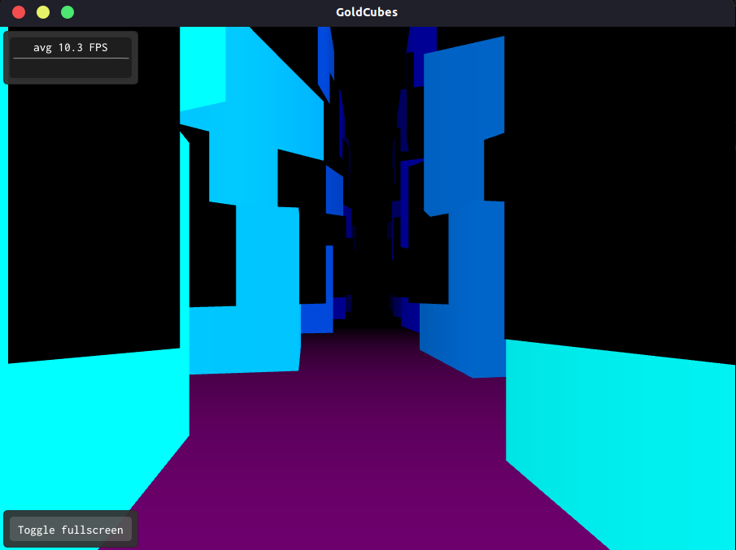
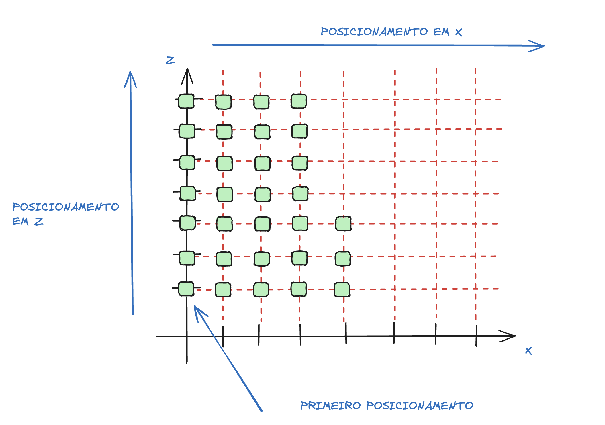

# Computação Gráfica - UFABC
## Atividade 2 - Aplicação gráfica 3D com animações

Link WebAssembly: https://gabrielyuto.github.io/GoldCubes/public/GoldCubes.html

### Integrantes:
Nomes:
- Fernando Schroder
- Gabriel Yuto Munakata

Registros Acadêmico:
- 11201921885
- 11201721879

### Descrição da aplicação
O objetivo desta aplicação é criar um cenário de um labirinto em cubos, de modo que existem cubos dourados dentro deste labirito que precisam ser encontrados.


<div align="center">



</div>

A aplicação teve como base o projeto LookAt apresentado durante as aulas de laboratório. Dessa forma, foi construído um cenário em que é gerado um "solo" com base na classe ground.cpp e ground.hpp, e também é construído a classe camera.cpp e camera.hpp para se obter uma visão do espaço da camera a partir do espaço do mundo.

### Implementação
Para a implementação, primeiro foi feita uma modificação dos valores de core RGB do solo, atribuindo a cor da seguinte forma:

```c++
abcg::glUniform4f(m_colorLoc, 1.0, 0.0, 1.0, 1.0f);
```

Ja em relação a construção do cenário com cubos, simulando o labirinto, utilizamos dentro do método onPaint() alguns loops para renderizar o box.obj importado da pasta assets.
Para a posicionamento dos cubos, foi a seguinte implementaçã0:

```c++
  const int limit_sup{50};
  const int limit_inf{-50};
  
  for (int x = limit_inf; x < limit_sup; x++) {
    for (int z = limit_inf; z < limit_sup; z++) {
      glm::mat4 model{1.0f};
      model = glm::translate(model, glm::vec3(x, 0.5f, z));
      model = glm::rotate(model, glm::radians(10.0f), glm::vec3(0, 1, 0));
      model = glm::scale(model, glm::vec3(0.5f));

      abcg::glUniformMatrix4fv(m_modelMatrixLocation, 1, GL_FALSE, &model[0][0]);
      abcg::glUniform4f(m_colorLocation, x, (x + z), z, 1.0f);
      abcg::glDrawElements(GL_TRIANGLES, m_indices.size(), GL_UNSIGNED_INT, nullptr);                  
    }
  }
```

O primeiro loop descreve a posição no eixo x que iremos colocar os cubos, e o segundo loop descreve a posição no eixo z. Com base nesse vetor (x,z), temos as coordenadas da posição dos cubos, no qual é transladado por meio do método glm::translate.
Adicionamos uma pequena rotação para criar um efeito mais interessante para a aplicação. E por fim, ajustamos a escala do objeto por meio do método glm::rotate e atribuimos uma cor ao cubo.

Um esquema detalhando a contrução do cenário é descrito na figura abaixo:


<div align="center">



</div>

Tendo como base a geração dos primeiros cubos, repetimos o mesmo loop para gerar cubos acima dos mesmos, de modo a se construir paredes de cubos. A diferença se encontra no posicionamento no eixo y, a rotação dos objetos e a cor atribuido.


Por fim, existe um loop for que gera cubos dourados em diversas direções dentro do cenário.
A exemplificação de como ocorre essa geração e indicada no código abaixo:


```c++
const int count_gold_cube{10};

  for (int a = 0; a < count_gold_cube; a++) {
    for(int b = 0; b  < count_gold_cube; b++){
      glm::mat4 model{1.0f};
      model = glm::translate(model, glm::vec3(a/2, 0.5f, b/2));
      model = glm::rotate(model, glm::radians(90.0f), glm::vec3(0, 1, 0));
      model = glm::scale(model, glm::vec3(0.1f));

      abcg::glUniformMatrix4fv(m_modelMatrixLocation, 1, GL_FALSE, &model[0][0]);
      abcg::glUniform4f(m_colorLocation, 255, 223, 0.0, 1.0f);
      abcg::glDrawElements(GL_TRIANGLES, m_indices.size(), GL_UNSIGNED_INT, nullptr);
    }
  }
````
