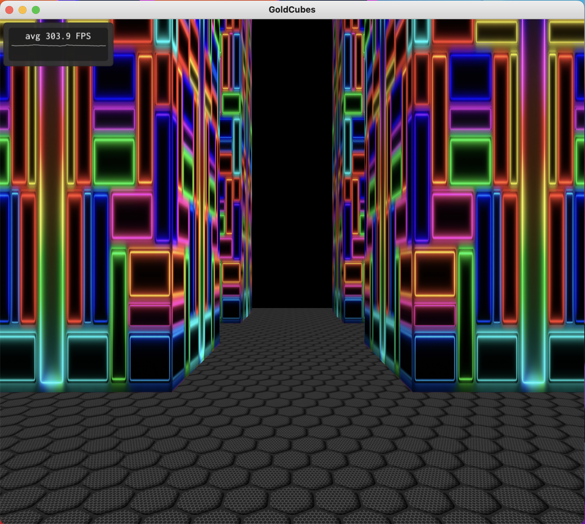

# Computação Gráfica - UFABC
## Atividade 3 - Aplicação interativa com gráficos 3D, iluminação e texturização

Link WebAssembly: https://gabrielyuto.github.io/GoldCubesGame/public/GoldCubes.html
Link para o vídeo do Youtube: https://www.youtube.com/watch?v=kAWeEBukILc

### Integrantes:
Nomes:
- Fernando Schroder
- Gabriel Yuto Munakata

Registros Acadêmico:
- 11201921885
- 11201721879

### Descrição da aplicação
O objetivo desta aplicação é criar um cenário de um labirinto em cubos, de modo que existe um cubo dourado dentro deste labirito que precisa ser encontrado.

<div align="center">



</div>

A aplicação teve como base o projeto LookAt apresentado durante as aulas de laboratório e dos projetos de iluminação e texturização das viewers. Dessa forma, foi construído um cenário em que é gerado um "solo" com base em um arquivo obj nomeado como ground, e pilastras construídas com o obj wall. O cubo dourado e o troféu também são arquivos obj. Para a disposição das pilastras, utilizamos de uma classe maze que realiza a organização das pilastras com base na disposição de objetos mapeados no arquivo levels/map.txt. Em relação à classe model, foi utilizada com base nas aulas da disciplina, sendo a sua função permitir a criação dos parâmetros necessários para a construção dos arquivos obj e aplicação de texturização. Também é construído a classe camera.cpp e camera.hpp para se obter uma visão do espaço da camera a partir do espaço do mundo (foi utilizado os mesmos contextos abordados no projeto LookAt). Por fim, o controle de todas a implementação da criação dos cenários e controle de colisão com objetos foi implementado dentro da classe window.

### Implementação
Para explicar a implementação, iremos tomar como base a classe window, que faz uso das demais classes do projeto. O primeiro método disponibilizado nesta classe é o onEvent. Ele é responsável por gerenciar os eventos de tecla para movimentar a câmera.

No método onCreate, é feito a inicialização dos modelos, fonte do texto de mensagem, camera e labirinto.
Para carregar a fonte do texto, é realizado por meio da seguinte implementação, que irá buscar a fonte no path "fonts/Inconsolata-Medium.ttf"

```c++
auto const filename{assetsPath + "fonts/Inconsolata-Medium.ttf"};
  m_font = ImGui::GetIO().Fonts->AddFontFromFileTTF(filename.c_str(), 50.0f);
  if (m_font == nullptr) {
    throw abcg::RuntimeError("Cannot load font file");
  }
```
E para inicializar os objetos, que são inicializados a partir da classe model.cpp e model.hpp, é feito da seguinte forma (na sequencia, é inicializado o solo, os pilares, o cubo dourado e o troféu):

```c++
m_groundModel.loadObj(assetsPath + "models/ground.obj", false);
m_groundModel.setupVAO(m_programs.at(0));

m_wallModel.loadObj(assetsPath + "models/wall.obj", false);
m_wallModel.setupVAO(m_programs.at(0));

m_box.loadObj(assetsPath + "models/box.obj", false);
m_box.setupVAO(m_programs.at(0));

m_trophy.loadObj(assetsPath + "models/trophy.obj", false);
m_trophy.setupVAO(m_programs.at(0));
```
Bem como também nesta classe é inicializado as propriedades de materiais (que são o mesmo para os modelos carregados pelo model.cpp):

```c++
m_Ka = m_wallModel.getKa();
m_Kd = m_wallModel.getKd();
m_Ks = m_wallModel.getKs();
m_shininess = m_wallModel.getShininess();
m_mappingMode = 3;
```
No método onPait, é renderizado o labirinto, o cubo dourado e o troféu (estes dois últimos seguindo a lógica da variável won, em que se o jogador ganhar, ela é definida como TRUE, e assim deixamos de renderizar o cubo dourado para renderizar o troféu).

Em relação ao método onPaintUI, utilizamos o mesmo para a parte do texto, que é exibido quando o cubo dourado é encontrado.

O método onResize utilizamos para ajustar a visão da câmera quando a janela do jogo é redimensionada.

Já o método onUpdate faz a atualização do posicionamento da câmera quando é movimentado pelas teclas de seta.

OnDestroy finaliza os m_programs.

E por fim, para renderizar o labirinto, o cubo dourado e o troféu, foram criados métodos específicos:

- renderMaze()
- renderBox()
- renderTrophy()

Ambos os métodos seguem lógicas padrão para gerenciar os materias, iluminação, textura e matrizes de localização. O que há de especifico para cada um, além de diferenciar o material de textura, e a forma como posicionamos e aumentamos o tamanho dos objetos.

Para a renderização dos pilares, é feito através de um loop for, da seguinte forma:
```c++
for (size_t i = 0; i < m_maze.m_mazeMatrix.size(); i++) {
  for (size_t j = 0; j < m_maze.m_mazeMatrix[i].size(); j++) {
    float xPos = static_cast<float>(i);
    float yPos = static_cast<float>(j);

    glm::mat4 modelMatrix{1.0f};
    modelMatrix = glm::translate(modelMatrix, glm::vec3(xPos, 0.0f, yPos));
    glUniformMatrix4fv(modelMatrixLoc, 1, GL_FALSE, &modelMatrix[0][0]);

    auto modelViewMatrix{glm::mat3(m_camera.m_viewMatrix * modelMatrix)};
    glm::mat3 normalMatrix{glm::inverseTranspose(modelViewMatrix)};
    glUniformMatrix3fv(normalMatrixLoc, 1, GL_FALSE, &normalMatrix[0][0]);

    if (m_maze.isBox(i, j) && won == false) {
      m_wallModel.render();
    } else {
      m_groundModel.render();
    }
  }
}
```

O primeiro loop descreve a posição no eixo x que iremos colocar as pilastras, e o segundo loop descreve a posição no eixo z. Com base nesse vetor (x, y-fixo, z), temos as coordenadas da posição das pilastras, no qual é transladado por meio do método glm::translate.

Um esquema detalhando a contrução do cenário é descrito na figura abaixo:

<div align="center">


</div>

Para a renderização do cubo dourado, é feito através do método renderBox. O que é importante comentar do método, é que fizemos o posicionamento com o glm::translate e diminuimos o tamanho com o glm:scale, da seguinte forma:

```c++
glm::mat4 modelMatrix{1.0f};
modelMatrix = glm::translate(modelMatrix, cube_pos);
modelMatrix = glm::scale(modelMatrix, glm::vec3(0.1f));
glUniformMatrix4fv(modelMatrixLoc, 1, GL_FALSE, &modelMatrix[0][0]);

auto modelViewMatrix{glm::mat3(m_camera.m_viewMatrix * modelMatrix)};
glm::mat3 normalMatrix{glm::inverseTranspose(modelViewMatrix)};
glUniformMatrix3fv(normalMatrixLoc, 1, GL_FALSE, &normalMatrix[0][0]);
````
Além disso, neste método também incluímos o controle de colisão da câmera com o cubo dourado, através da seguinte implementação:

```c++
// Verifica se colidiu ou não
  float distance = glm::distance2(m_camera.getm_eye(), cube_pos);
  if (distance < 0.05f) {
    won = true;
  }
```

Por fim, seguinte a mesma lógica, implementamos a renderização do troféu através do método enderTrophy da seguinte forma:

```c++
glm::mat4 modelMatrix{1.0f};
modelMatrix = glm::translate(modelMatrix, trophy_pos);
modelMatrix = glm::rotate(modelMatrix, glm::radians(90.0f), glm::vec3(0, 1, 0));
modelMatrix = glm::scale(modelMatrix, glm::vec3(0.35f));
glUniformMatrix4fv(modelMatrixLoc, 1, GL_FALSE, &modelMatrix[0][0]);

auto modelViewMatrix{glm::mat3(m_camera.m_viewMatrix * modelMatrix)};
glm::mat3 normalMatrix{glm::inverseTranspose(modelViewMatrix)};
glUniformMatrix3fv(normalMatrixLoc, 1, GL_FALSE, &normalMatrix[0][0]);
```

## Explicações das funções por arquivo do repositório:

1. camera.cpp e camera.hpp

Estes arquivos contêm a implementação e declaração de uma classe de câmera, que é usada para controlar a visão do jogador no jogo. Funções comuns incluem:

    Inicialização da câmera.
    Ajuste da posição e orientação da câmera.
    Métodos para manipular a visualização, como zoom, rotação e translação.

2. main.cpp

Este é o ponto de entrada do programa. Normalmente, contém:

    A função main, que inicializa o jogo e inicia o loop principal.
    Configurações iniciais do jogo, como criação de janelas e inicialização de subsistemas.

3. maze.cpp e maze.hpp

Estes arquivos são responsáveis pela lógica e representação do labirinto no jogo.

    Funções para gerar o layout do labirinto.
    Métodos para desenhar o labirinto na tela.
    Lógica para detectar colisões ou interações dentro do labirinto.

4. model.cpp e model.hpp

Esses arquivos lidam com a representação de modelos 3D no jogo. Funções comuns incluem:

    Carregamento de modelos a partir de arquivos.
    Renderização de modelos na tela.
    Manipulação de propriedades dos modelos, como posição, escala e rotação.

5. window.cpp e window.hpp

Estes arquivos são responsáveis pela criação e gerenciamento da janela do jogo. Eles podem incluir:

    Funções para criar e configurar a janela do jogo.
    Loop de eventos para processar entradas do usuário e atualizações de tela.
    Métodos para lidar com eventos de janela, como redimensionamento ou fechamento.

Vou verificar o conteúdo específico de cada arquivo para fornecer detalhes mais precisos. ​

​GoldCubesGame:
camera.cpp

    initializeCamera(Maze maze): Inicializa a câmera com o labirinto.
    computeViewMatrix(): Calcula a matriz de visualização da câmera.
    computeProjectionMatrix(glm::vec2 const &size): Calcula a matriz de projeção da câmera.
    dolly(float speed): Move a câmera para frente/trás.
    truck(float speed): Move a câmera para esquerda/direita.
    pan(float speed): Rotaciona a câmera.

main.cpp

    main(int argc, char **argv): Função principal do programa.

maze.cpp

    initializeMaze(std::string path): Inicializa o labirinto com um caminho específico.

model.cpp

    loadObj(std::string_view path, bool standardize): Carrega um modelo OBJ.
    loadDiffuseTexture(std::string_view path): Carrega a textura difusa do modelo.
    loadNormalTexture(std::string_view path): Carrega a textura normal do modelo.
    createBuffers(): Cria buffers para o modelo.
    standardize(): Padroniza o modelo.
    computeNormals(): Calcula as normais do modelo.
    computeTangents(): Calcula as tangentes do modelo.
    render() const: Renderiza o modelo.
    setupVAO(GLuint program): Configura o Vertex Array Object do modelo.


window.cpp

    onEvent(SDL_Event const &event): Lida com eventos da SDL.
    onCreate(): Chamada ao criar a janela.
    onPaint(): Chamada para pintar na janela.
    onPaintUI(): Chamada para pintar a interface do usuário.
    onResize(glm::ivec2 const &size): Chamada quando a janela é redimensionada.
    onUpdate(): Chamada para atualizar a janela.
    onDestroy(): Chamada ao destruir a janela.
    renderMaze(): Renderiza o labirinto.
    renderBox(): Renderiza uma caixa.
    renderTrophy(): Renderiza um troféu.
